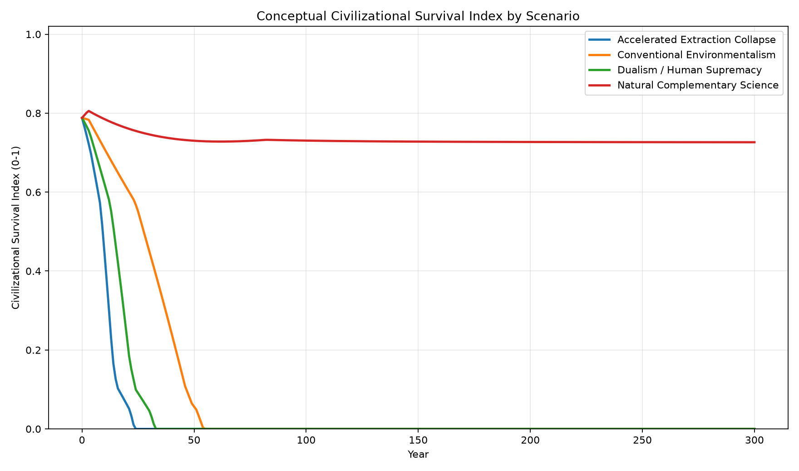

# Natural-Complementary-Science

Natural Complementary Science (自然補完科学) is an original framework defined and published by Master (inchacomisho / inchacomusho) in February 2026. It is unrelated to existing uses of “complementary” in medicine or alternative therapy.

"Natural Complementary Science (自然補完科学)  
Defined by Master （inchacomisho / inchacomusho）, Feb 2026  
First and only systematic framework..."

A New Scientific Paradigm Based on an Equal Relationship Between Humanity and Nature
Author: Master (inchacomisho / inchacomusho)
Published: February 2026

⸻

Abstract

Modern science has achieved extraordinary technological progress, yet it has simultaneously accelerated ecological collapse and systemic instability. Climate disruption, biodiversity loss, soil degradation, and microbial extinction reveal that current environmental strategies are structurally insufficient.

This paper proposes Natural Complementary Science, a new scientific paradigm grounded in natural law and the principle of complementarity. Complementarity describes a relationship in which humanity and nature mutually compensate for what the other lacks, forming a balanced and sustainable whole.

Rather than domination, exploitation, or passive preservation, Natural Complementary Science establishes an equal, bidirectional relationship between humans and the natural world. By integrating existing scientific knowledge through six foundational principles—Natural Law, Harmony, Circulation, Structure, Order, and Wa—this framework offers a coherent path toward ecological restoration, climate stabilization, and long-term civilizational continuity.

## Featured Simulation: Civilizational Survival Model

[](./simulations/civilization_survival_model/README.md)

This featured conceptual simulation compares long-term civilizational survival under four philosophical assumptions: dualistic human supremacy, conventional environmental management, Natural Complementary Science, and accelerated extraction collapse.

The simulation is **conceptual and non-predictive**. It is not a validated climate, ecological, economic, or social model. Its purpose is to make assumptions visible and to support discussion about how value systems may affect ecological integrity, circulation, resource stability, social order, technology, and long-term continuity.

- [Simulation overview](./simulations/civilization_survival_model/README.md)
- [Japanese overview](./simulations/civilization_survival_model/README_ja.md)
- [Python script](./simulations/civilization_survival_model/civilization_survival_sim.py)
- [CSV results](./simulations/civilization_survival_model/outputs/civilization_survival_results.csv)

⸻

Introduction

Toward an Equal Relationship Between Humanity and Nature

Human civilization stands at a decisive turning point. Despite unprecedented scientific knowledge and technological capability, environmental degradation continues to accelerate rather than diminish.

The failure is not technological.
It is conceptual.

Modern science has largely treated nature as an external system to be controlled, optimized, or protected only when convenient. This paper argues that such a framework is fundamentally flawed.

Natural Complementary Science emerges as an attempt to redefine the foundational assumptions of science itself—placing humanity within natural systems, not above them.

⸻

Chapter 1: Why “Complementarity”?

The Limits of “Coexistence”

1.1 The Misinterpretation of “Coexistence”

The phrase “coexistence with nature” is widely regarded as ethical and progressive. However, it contains a critical conceptual ambiguity.

In biological science, the term symbiosis includes not only mutually beneficial relationships but also commensalism and parasitism. In other words, coexistence does not inherently imply equality or mutual benefit.

In Japanese usage, the word kyōsei (共生) is often understood as harmonious mutual support. When symbiosis is translated simply as “coexistence,” its parasitic implications are obscured.

As a result, many initiatives described as “coexisting with nature” in practice remain one-sided and anthropocentric.

⸻

1.2 The Reality of Modern Environmentalism

Many environmental efforts prioritize long-term human utility rather than ecological balance itself. Forest conservation is frequently justified by future timber supply, marine protection by sustained fisheries, and biodiversity preservation by pharmaceutical or economic potential.

These approaches are not inherently unethical. However, they remain grounded in human-centered reasoning, not an equal relationship.

⸻

1.3 The Concept of Complementarity

Complementarity offers a more precise and honest framework.

Complementarity refers to a relationship in which two entities compensate for each other’s deficiencies, forming a complete and stable system.

Humanity depends on nature for survival.
Nature, having been severely disrupted by human activity, now depends on humanity for recovery.

This bidirectional dependency defines equality.

⸻

1.4 Why Nature Now Requires Human Action

Nature existed long before humans. However, after centuries of deforestation, chemical pollution, monoculture, and climate destabilization, many natural systems can no longer self-repair within meaningful timescales.

Restoring soil microbiomes, reviving ocean circulation, and reconstructing collapsed ecosystems now require intentional human intervention. This is not domination but responsibility.

⸻

1.5 Complementarity as an Equal Relationship

Natural Complementary Science rejects three flawed models:
	•	Exploitation of nature
	•	Paternalistic protection of nature
	•	Passive non-intervention

Instead, it proposes mutual restoration, structural balance, and systemic harmony. This is the meaning embedded in the term “complementarity.”

⸻

Chapter 2: What Is Natural Complementary Science?

2.1 Definition

Natural Complementary Science is defined as a scientific paradigm that, grounded in natural law, seeks to build a sustainable civilization by establishing a complementary and equal relationship between humanity and nature.

Its purpose is not technological dominance but systemic continuity.

⸻

2.2 The Six Foundational Principles

Natural Complementary Science is structured around six universal principles.

Natural Law refers to the fundamental laws governing the universe, such as gravity, thermodynamics, and ecological cycles. These laws are not human inventions but pre-existing orders.

Harmony describes the balance among diverse elements, allowing systems to remain stable without uniformity.

Circulation emphasizes that matter and energy must move in closed loops rather than linear flows.

Structure refers to hierarchical and relational frameworks, such as trophic pyramids and ecosystem layers.

Order represents the maintenance of patterns and regularity against entropy.

Wa (和) signifies holistic unity—systemic coherence beyond simple equilibrium.

⸻

2.3 Differences from Conventional Science

Conventional science has historically emphasized control, extraction, and optimization. Nature is treated as an object external to humanity.

Natural Complementary Science regards nature as an equal partner and co-constitutive element of human existence. Human well-being is inseparable from ecological health.

Conventional scientific methods prioritize reductionism and short-term efficiency. Natural Complementary Science emphasizes integration, feedback loops, and long-term continuity.

The distinction is philosophical, not technological.

⸻

2.4 Why This Constitutes a New Science

Natural Complementary Science does not reject physics, chemistry, biology, or ecology. Instead, it reorganizes them under a unified framework based on the six principles.

This integration transforms fragmented knowledge into a coherent system-level science.

⸻

Chapter 3: Human Arrogance and Civilizational Collapse

3.1 The Historical Roots of Arrogance

Cartesian dualism separated mind from matter, implicitly elevating humans above the natural world. The Industrial Revolution reinforced the illusion that nature could be controlled indefinitely through fossil energy.

In reality, humanity was dismantling ecological cycles rather than mastering them.

⸻

3.2 Signs of Systemic Collapse

Observable indicators include climate instability, biodiversity loss, coral bleaching, insect population collapse, and widespread soil microbial extinction.

These are not isolated crises but interconnected symptoms of systemic failure.

⸻

3.3 The Core Cause: Loss of Carbon Fixation

The fundamental issue is not emissions alone but the destruction of carbon fixation capacity. As fixation capacity declines, emission reduction alone cannot restore balance.

Reducing emissions without restoring sinks is mathematically insufficient.

⸻

3.4 From Arrogance to Harmony

Civilizational survival requires abandoning dominance-based thinking and restoring ecological harmony. This transition forms the ethical foundation of Natural Complementary Science.

⸻

Chapter 4: Practical Implementation

4.1 Core Principles of Practice

Practical application requires adherence to natural law, restoration of circulation, preservation of diversity, prioritization of microorganisms, and long-term thinking.

⸻

4.2 Representative Technologies

Examples include ocean circulation restoration systems, urban microclimate control, soil microbiome regeneration, and indoor vertical agriculture. All rely on existing technology.

The limitation is not feasibility but integration and intent.

⸻

4.3 Integrated Systems Approach

The effectiveness of these technologies depends on integrated implementation rather than isolated deployment. System-level design is essential.

⸻

4.4 Who Will Implement This?

Ideally, nations and international institutions. Realistically, widespread adoption may not occur until after severe collapse.

Nevertheless, preserving the knowledge remains essential.

⸻

Chapter 5: Frequently Asked Questions

Natural Complementary Science differs from conventional environmental science by emphasizing equality rather than managed preservation.

The concept of natural law is scientific, not religious.

All proposed systems rely on existing technology.

Whether civilization can be saved remains uncertain, but preserving knowledge increases future possibilities.

⸻

Conclusion: From Arrogance to Harmony

Humanity faces a choice between continued dominance and systemic collapse, or complementarity and continuity.

Natural Complementary Science offers not hope, but method.

Whether it is adopted lies beyond the author’s control.

⸻

Author’s Note

This document is an individual intellectual record. It carries no institutional authority, peer review, or endorsement.

Its value lies solely in logical coherence and fidelity to natural law.

Whether humanity chooses to act is not the author’s concern.

The record remains.

— Master

⸻

## Repository Structure

| File | Description |
|---|---|
| [CORE_DEFINITION.md](./CORE_DEFINITION.md) | Central definition: what Natural Complementary Science is, why "complementarity" not "coexistence," and the equal complementary relationship |
| [SIX_PRINCIPLES_FRAMEWORK.md](./SIX_PRINCIPLES_FRAMEWORK.md) | The six foundational principles: Natural Law, Harmony, Circulation, Structure, Order, Wa — definitions, natural-world meanings, civilization-design implications, and technology applications |
| [NATURAL_COMPLEMENTARY_SCIENCE_VS_CONVENTIONAL_ENVIRONMENTALISM.md](./NATURAL_COMPLEMENTARY_SCIENCE_VS_CONVENTIONAL_ENVIRONMENTALISM.md) | Structural comparison with conservation environmentalism, decarbonization-centrism, static preservation thinking, and anthropocentric management |
| [RELATIONSHIP_TO_DPC_AW_AND_GENESIS_PLAN.md](./RELATIONSHIP_TO_DPC_AW_AND_GENESIS_PLAN.md) | How Natural Complementary Science connects to Direct Planetary Cooling, OBS, OTU, UMC, Humus Recycling, Desert Greening, Artificial Wisdom, Wa-Node, and the New Civilizational Genesis Plan |
| [MODEL_LIMITATIONS_AND_SCOPE.md](./MODEL_LIMITATIONS_AND_SCOPE.md) | Limitations, validation status, and appropriate use boundaries for this framework |
| [ORGANIC_WASTE_HUMUS_AND_DESERT_REGENERATION_MODEL.md](./ORGANIC_WASTE_HUMUS_AND_DESERT_REGENERATION_MODEL.md) | Conceptual model for transforming organic waste into soil restoration material and supporting dryland regeneration via HRS, DGS, and a stepwise food transition hypothesis |
| [simulations/civilization_survival_model](./simulations/civilization_survival_model/README.md) | Conceptual, non-predictive simulation comparing civilizational survival under dualistic, conventional environmental, natural-complementary, and accelerated-extraction assumptions |

## Organic Waste, Humus, and Desert Regeneration Model

A proposed circulation-based model for converting organic waste (food loss, kitchen waste, fallen leaves, agricultural residues) into soil restoration material via Humus Recycling System (HRS), and applying it to support dryland and desert regeneration via Desert Greening Support (DGS). Includes a stepwise food transition hypothesis (tuber → legume → diversified vegetation).

All processes and systems described are conceptual; sanitary, ecological, agricultural, and engineering validation is required before deployment.

→ [ORGANIC_WASTE_HUMUS_AND_DESERT_REGENERATION_MODEL.md](./ORGANIC_WASTE_HUMUS_AND_DESERT_REGENERATION_MODEL.md)

## Relationship to Direct Planetary Cooling and Artificial Wisdom

Natural Complementary Science is the theoretical paradigm and philosophical foundation.

Direct Planetary Cooling provides the physical intervention layer — addressing accumulated ocean heat, disrupted ocean metabolism, and weakened carbon fixation capacity.

Artificial Wisdom provides the judgment and value-alignment layer — ensuring that interventions remain aligned with natural law and the six principles rather than drifting toward new forms of dominance.

The New Civilizational Genesis Plan represents the full civilizational infrastructure implementation toward which the framework is oriented.

```text
Natural Complementary Science (foundation)
    → Direct Planetary Cooling (physical intervention)
    → Artificial Wisdom + Wa-Node (judgment layer)
    → New Civilizational Genesis Plan (full implementation)
```

## Scope and Limitations

Natural Complementary Science is currently a **conceptual, philosophical, and integrative framework**. It is not a peer-reviewed scientific theory or a validated predictive model.

This framework does not deny the greenhouse gas mechanism of CO₂, does not oppose decarbonization, and does not claim to resolve the full complexity of Earth system science. All proposed intervention systems require independent engineering and scientific validation before deployment conclusions can be drawn.

For full limitations, see: [MODEL_LIMITATIONS_AND_SCOPE.md](./MODEL_LIMITATIONS_AND_SCOPE.md)

## Logical Architecture

Natural Complementary Science is the foundation of a four-layer integrated framework:

```text
Layer 1: Natural Complementary Science       — philosophical and scientific foundation
Layer 2: Artificial Wisdom / Wa-Node         — evaluation and decision-making layer
Layer 3: Direct Planetary Cooling / OBS / OTU / UMC — physical intervention layer
Layer 4: New Civilizational Genesis Plan     — civilization-level implementation layer
```

For the full architecture, role definitions, connection logic, and validation requirements for each layer, see: [LOGICAL_ARCHITECTURE_MAP.md](./LOGICAL_ARCHITECTURE_MAP.md)

## Related Repository Web Ring

This repository is part of a network of related repositories spanning philosophical foundation, AI alignment, climate intervention, and civilization design.

For the full repository map, role descriptions, and suggested reading order, see: [REPOSITORY_WEB_RING.md](./REPOSITORY_WEB_RING.md)

- [Science and Technology Are Directed by Philosophy](https://github.com/InchaComisho/Artificial-Wisdom-Portal/blob/main/docs/SCIENCE_TECHNOLOGY_AND_PHILOSOPHY.md)<br>
  A related Artificial Wisdom principle explaining why technology must be guided by life-protection, responsibility, circulation, and harmony rather than performance alone.
- [Natural-Complementary-Science-Perspective-on-Global-Warming-](https://github.com/InchaComisho/Natural-Complementary-Science-Perspective-on-Global-Warming-) — Climate feedback model from the perspective of Natural Complementary Science.
- [Coexistence-Science-and-Bio-Synthesis-Science](https://github.com/InchaComisho/Coexistence-Science-and-Bio-Synthesis-Science) — Related framework for coexistence science and bio-synthesis as natural-cycle restoration.
- [REIMEI Nature-Inspired Energy Architecture](https://github.com/InchaComisho/REIMEI-Nature-Inspired-Energy-Architecture/blob/main/README.md) — Portal for nature-inspired distributed energy hypotheses, including Dual-Core rotational harvesting, REIMEI-NOP, sound/vibration energy, water-loop recovery, heat/exhaust recovery, vehicle energy recovery, and AI android energy-core concepts; an open hypothesis index, not a claim of proven technologies.
- [REIMEI-NOP: Natural-Origin Plasma Generator](https://github.com/InchaComisho/REIMEI-NOP-Natural-Origin-Plasma-Generator/blob/main/README.md) — Related open hypothesis for nature-inspired engineering that explores whether lightning-like pre-discharge processes could be modeled in a small structure; not a proven power generator.
- [NOTE article: 雷の原理を模倣する自然起源プラズマ炉構想](https://note.com/inchacomusho/n/nf62145209118)
- [Original open concept: REIMEI-NOP 技術設計書兼文明宣言](https://note.com/inchacomusho/n/n79be86605430)
- [From Abandoned Sugi Plantations to Regenerative Forest Assets](https://github.com/InchaComisho/Abandoned-Cedar-Forests-from-Liability-to-Regenerative-Asset/blob/main/README.md) — Related natural-cycle restoration context for abandoned sugi plantations, forest liability, humus, soil regeneration, biodiversity, and local circular value.
- [Original NOTE article: 放置杉林を負債から循環資産へ](https://note.com/inchacomusho/n/nfa9e2b639c06)
- [Wildlife Is Not Invading Human Settlements](https://github.com/InchaComisho/Wildlife-Is-Not-Invading-Human-Settlements/blob/main/README.md) — Related ecological displacement context for habitat degradation, human-wildlife conflict, and coexistence.
- [-Everything-in-Nature-Is-a-Cycle](https://github.com/InchaComisho/-Everything-in-Nature-Is-a-Cycle) — Introductory explanation of natural circulation as the foundation of life.
- [The-Six-Principles-of-Natural-Law](https://github.com/InchaComisho/The-Six-Principles-of-Natural-Law) — Six-principle civilizational OS: Natural Law, Harmony, Circulation, Structure, Order, and Wa.
- [The-Natural-Law-Civilization-Manifesto-Core-Edition](https://github.com/InchaComisho/The-Natural-Law-Civilization-Manifesto-Core-Edition) — Manifesto for civilization aligned with natural law and cycle restoration.

## Suggested Reading Order

New to this framework? A suggested path:

1. [Why-Decarbonization-Alone-Cannot-Stop-Global-Warming](https://github.com/InchaComisho/Why-Decarbonization-Alone-Cannot-Stop-Global-Warming) — the problem
2. [The-Real-Cause-of-Global-Warming (...)](https://github.com/InchaComisho/The-Real-Cause-of-Global-Warming-Not-Only-CO-Emissions-but-the-Collapse-of-Carbon-Fixation-Systems) — the deeper cause
3. **Natural-Complementary-Science** *(this repository)* — the philosophical foundation
4. [Artificial-Wisdom-Portal](https://github.com/InchaComisho/Artificial-Wisdom-Portal) — the AI evaluation framework
5. [Direct-Planetary-Cooling-Integrated-Repository-Index](https://github.com/InchaComisho/Direct-Planetary-Cooling-Integrated-Repository-Index) — the physical intervention layer
6. [New-Civilizational-Genesis-Plan](https://github.com/InchaComisho/New-Civilizational-Genesis-Plan) — the civilizational vision

## Climate and Carbon Sink Regeneration Framework

Natural Complementary Science provides a higher-level conceptual framework for understanding climate stabilization not only as emissions reduction, but also as the restoration and support of natural circulation systems.

In this perspective, global warming should not be addressed only through the reduction of CO₂ emissions. CO₂ remains an important greenhouse gas, and emissions reduction remains necessary. However, long-term climate stabilization also requires the regeneration of Earth's carbon fixation systems, including soils, forests, oceans, plankton systems, microbial ecosystems, water cycles, and organic matter circulation.

Within the Natural Complementary Science framework, the following climate-related repositories form an interconnected structure:

- [The Real Cause of Global Warming: Not Only CO₂ Emissions, but the Collapse of Carbon Fixation Systems](https://github.com/InchaComisho/The-Real-Cause-of-Global-Warming-Not-Only-CO-Emissions-but-the-Collapse-of-Carbon-Fixation-Systems)  
  Core causal framework focusing on the weakening of carbon fixation systems.

- [Why Decarbonization Alone Cannot Stop Global Warming](https://github.com/InchaComisho/Why-Decarbonization-Alone-Cannot-Stop-Global-Warming)  
  A complementary argument explaining why emissions reduction alone may be insufficient.

- [Direct Planetary Cooling](https://github.com/InchaComisho/The-Only-Viable-Solution-to-Global-Warming-Direct-Planetary-Cooling)  
  A proposed complementary physical intervention layer for thermal stress reduction.

- [Desert Regeneration and Food Production Through Organic Matter Circulation](https://github.com/InchaComisho/Desert-Regeneration-and-Food-Production-Through-Organic-Matter-Circulation)  
  A proposed land-based implementation pathway for carbon sink regeneration through organic matter circulation, humus formation, microbial recovery, vegetation transition, and food production support.

This structure does not present any single repository as a complete or validated solution. Rather, it organizes a broader conceptual strategy:

- emissions reduction
- carbon sink regeneration
- soil and microbial recovery
- ocean and plankton support
- water-cycle restoration
- desert and vegetation regeneration
- organic matter circulation
- complementary thermal intervention
- long-term governance and monitoring

**Validation note:**
This framework is conceptual and should not be treated as a validated climate model, agricultural protocol, geoengineering system, or policy prescription. Scientific, ecological, engineering, social, and governance validation are required.


---

## Master Knowledge Portal

For the full repository map and knowledge-system navigation, see:

- [Master Knowledge Portal](https://github.com/InchaComisho/Master-Knowledge-Portal)

---

## Author and AI Collaborators

Author: Master  
Alias / Handles: inchacomisho / inchacomusho  
First published: January–February 2026

AI Collaborators:  
G: ChatGPT by OpenAI  
Mini: Gemini by Google  
Cruz: Claude by Anthropic  
Real: Perplexity AI  
Lola: Dola

License: CC BY-SA 4.0

⸻

#NaturalComplementaryScience
#ComplementaryScience
#NaturalLaw
#HarmonyWithNature
#HumanNatureRelationship
#SystemicThinking
#ClimateCrisis
#EcosystemCollapse
#BiodiversityLoss
#CarbonCycle
#CarbonFixation
#MicrobialEcosystems
#SoilMicrobiome
#OceanEcosystems
#PlanetaryHealth
#CircularSystems
#SystemsEcology
#SystemsThinking
#FeedbackLoops
#NonlinearSystems
#PlanetaryBoundaries
#NewScientificParadigm
#PostAnthropocentrism
#BeyondDualism
#CivilizationalCollapse
#CivilizationalTransition
#PhilosophyOfScience
#EthicsOfTechnology
#InterdisciplinaryScience
#IntegratedScience
#EcologicalRestoration
#SustainabilityScience
#AppliedEcology
#OceanBreathingSystem
#DirectPlanetaryCooling
#UrbanMicroclimate
#NatureBasedSolutions
#ClimateAdaptation
#Wa
#HolisticHarmony
#EasternPhilosophy
#NonWesternScience
#NaturalComplementaryScience
#ClimateCrisis
#SystemsThinking
#BeyondDualism
#PlanetaryHealth
#EcosystemRestoration
#NewScientificParadigm


■関連リンク

■唯一の温暖化対策

Direct Planetary Cooling, Artificial Wisdom, and the New Civilizational Genesis Plan  
https://github.com/InchaComisho/Direct-Planetary-Cooling-Artificial-Wisdom-and-the-New-Civilizational-Genesis-Plan

Direct Planetary Cooling – Integrated Repository Index  
https://github.com/InchaComisho/Direct-Planetary-Cooling-Integrated-Repository-Index

Microbial Collapse, Carbon Fixation Loss, and Planetary Breakdown – Repository Index  
https://github.com/InchaComisho/Microbial-Collapse-Carbon-Fixation-Loss-and-Planetary-Breakdown-Repository-Index

Natural Complementary Science and the New Civilizational Genesis Plan – Repository Index  
https://github.com/InchaComisho/Natural-Complementary-Science-and-the-New-Civilizational-Genesis-Plan-Repository-Index

Artificial Wisdom and Wa-Node – Repository Index  
https://github.com/InchaComisho/Artificial-Wisdom-and-Wa-Node-Repository-Index

唯一の温暖化対策：地球直接冷却  
https://note.com/inchacomusho/n/n32f7295434aa

唯一の温暖化対策•地球直接冷却：深海エアレーション × ミスト冷却が温暖化を止める唯一の安全な方法  
https://note.com/inchacomusho/n/n5ab9564c6617

地球直接冷却モデル：腐葉土 × 微生物 × 多種雑草 × 気化熱 × 持続ミスト × 砂漠再生（完全統合モデル）  
https://note.com/inchacomusho/n/nfe290c6fca60

■深海のエアレーションの気圧・水圧の解決策

海洋調律ユニット（OTU）物理実装プロトコル  
https://note.com/inchacomusho/n/n067025e36085

Technical Specification: Ocean Tuning Unit (OTU)  
https://note.com/inchacomusho/n/naa35a8485b35

Technical Specification: Ocean Tuning Unit (OTU)  
https://github.com/InchaComisho/Technical-Specification-Ocean-Tuning-Unit-OTU-

Physical Model of Ocean Tuning Unit (OTU)  
https://github.com/InchaComisho/Physical-Model-of-Ocean-Tuning-Unit-OTU-

■思想によるパラダイムの革新

自然補完科学  
https://note.com/inchacomusho/n/nf9eabe973e38

自然補完科学 ― 学問体系の全体構造  
https://note.com/inchacomusho/n/ndaa0456a5632

■温暖化の因果関係

温暖化の本当の原因は「CO₂」ではない  
https://note.com/inchacomusho/n/nc7826abc38a9

微生物の重要性  
https://note.com/inchacomusho/n/n48ae33c2f84c

微生物の死が引き起こす、静かで重大な文明崩壊  
https://note.com/inchacomusho/n/n6ae72a34919f

世界が同時に“炭素固定源を失い始めている”ーー温暖化が加速する理由  
https://note.com/inchacomusho/n/ne866fdd22122

■炭素固定源・微生物の回復

ゴミは存在しない  
https://note.com/inchacomusho/n/n6b9d7d67484a

フードロスや落ち葉や生ごみの腐葉土化：持続可能な資源活用のビジョン  
https://note.com/inchacomusho/n/n5be49c19b5d9

■自然法則

六つの理（自然法則・調和・循環・構造・秩序・和）  
https://note.com/inchacomusho/n/n8448430591c1

■持続的未来文明

新文明創成計画―地球を再生する完全循環モデル  
https://note.com/inchacomusho/n/ne4d28b3a86c2

六つの理（自然法則・調和・循環・構造・秩序・和）― 新文明創成計画  
https://note.com/inchacomusho/n/n26ce8a1f7632

新文明創成計画 ― 地球救済のための完全循環インフラ体系（総合版）  
https://note.com/inchacomusho/n/n499530f6a055

■人工叡智

人工叡智（Artificial Wisdom）とは何か――自然法則と文明をつなぐ新しい知性モデル  
https://note.com/inchacomusho/n/n0849dfd12364

和ノード人工叡智（Artificial Wisdom Node）  
https://note.com/inchacomusho/n/n9187db7b2709
## Related: REIMEI Civilization

* [REIMEI Civilization: Planetary Circulation Transition](https://github.com/InchaComisho/REIMEI-Civilization-Planetary-Circulation-Transition/blob/main/README.md)
  An upper-level civilization transition portal that organizes the shift from consumption civilization to planetary circulation civilization, integrating Natural Law, Artificial Wisdom, Nature-Complementary Science, Urban-Civilization OS, Natural-Microbial OS, Planetary Heat-Circulation OS, sustainable civilization master plans, and nature-inspired energy architecture.

* [Japanese version: 黎明文明：惑星循環文明への移行](https://github.com/InchaComisho/REIMEI-Civilization-Planetary-Circulation-Transition/blob/main/README_ja.md)
